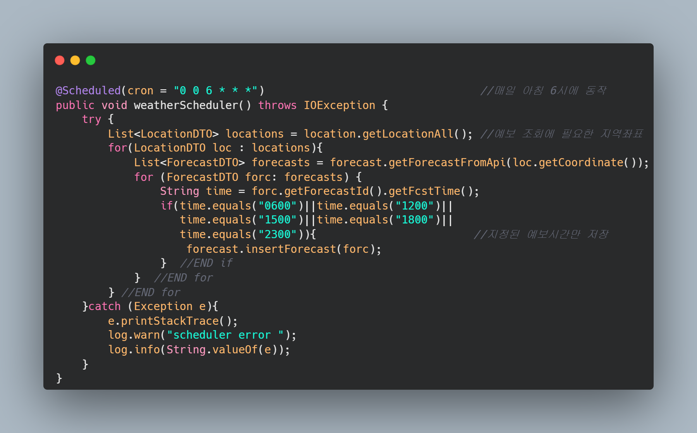

# yesterday-s-weather

      

<h3> Spring Boot 기반 스케쥴러 구현 </h3>

  <b>"어제의 날씨"</b> 프로젝트의 가장 큰 문제는 공공데이터 포털에서 제공하는 기상청 API에서 오늘의 일기예보 데이터 만을 제공한다는 점 이었습니다. 다시말해, 과거에 내려진 기상예보의 경우 API에서 조회를 해올 수 없다는 점 이었습니다. 저는 이런 문제를 해결 하기 위해, 일정 시간이 되면 기상청 api에서 일기예보를 조회해서 Server DB에 저장하는 Scheduler 구현을 최우선 과제로 정하고 구현 하였습니다.    

매일 일정한 시간에 로직을 수행하기 위해 Spring Scheduler에 cron식을 사용하여 매일 아침 6시에 데이터가 저장되도록 하였습니다.

<h3>이슈</h3>

1) 복합키 ENTITY <-> DTO 간 매핑이 되지 않던 문제 -> modelMapper의 Deep Mapping을 통해 해결(http://modelmapper.org/user-manual/) 
2) 서버DB에 외부에서 접속되지 않던 문제 -> 에러로그 확인 결과 네트워크 설정 관련 문제로 추정, EC2 보안규칙 란에서 3306포트 인바운드 규칙을 추가하여 해결  
3) 서버프로그램 실행 후, 로그가 별도의 파일로 남지 않던 문제 -> 로그 파일이 별도로 추가되도록 세팅 추가 

  
