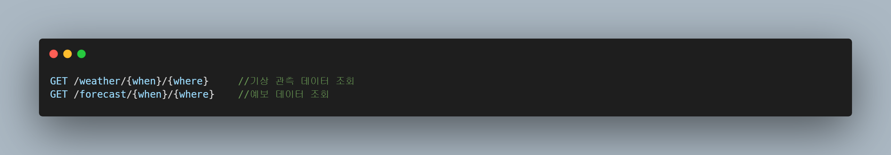

# yesterday-s-weather

      

<h1> 어제의 날씨 </h1>

<h2> 1. 프로젝트 소개</h2>

  <b>"어제의 날씨"</b> 는 어제의 일기예보와 실제 관측치를 비교해보는 데이터 시각화 서비스입니다.  기상청에서 제공하는 지역별 일기예보 데이터와 종관 관측데이터를 비교하여 표시
  하는 서비스 제공을 준비하고 있습니다. 추후 "오늘" 서비스와 "내일" 서비스를 추가하고, 날씨를 주제로 떠들수 있는 커뮤니티를 만드는 것을 목표로 하고있습니다. 

<h2> 2. 개발환경 소개</h2>

  1. openJDK v.1.8.0_332 
  2. Spring Boot v.2.6.5 
  3. MariaDB v.10.6.11 
  4. Hibernate 
  5. HTML5, SCSS  
  6. BOOTSTRAP v.5.2.1  
  7. Font Awesome Free v.6.2.0  
  8. TOAST UI Chart v.4.5.0  
  9. Amazon Lightsail  
  10.docker  

<h2> 3. 프로젝트 특징소개</h2>

<h3> 1) Spring Boot 기반 스케쥴러 구현 </h3>

  &nbsp;&nbsp;<b>"어제의 날씨"</b> 프로젝트의 가장 큰 문제는 공공데이터 포털에서 제공하는 기상청 API에서 오늘의 일기예보 데이터 만을 제공한다는 점 이었습니다. 다시말해, 과거에 내려진 기상예보의 경우 API에서 조회를 해올 수 없다는 점 이었습니다. 저는 이런 문제를 해결 하기 위해, 일정 시간이 되면 기상청 api에서 일기예보를 조회해서 Server DB에 저장하는 Scheduler 구현을 최우선 과제로 정하고 구현 하였습니다. 매일 일정한 시간에 로직을 수행하기 위해 Spring Scheduler에 cron식을 사용하여 매일 아침 11시 10분에 데이터가 Server DB에 저장되도록 하였습니다. 

<h3> 2) RESTFUL API 구현하기위해 노력 </h3>

  RESTful한 서버 구성을 위하여 
  1. Spring이 지원하는 PathVariable을 이용하였습니다. 
  2. 자원에 대한 행위는 HTTP Method를 이용하여 표현하고자 했습니다.  
  3. HTTP 상태코드를 활용해 클라이언트에 상태를 전달하고자 했습니다.  

<h3> 3) PC와 Mobile 기기에서 동일한 사용자 경험을 할 수 있도록 화면을 구현했습니다. </h3>

  RESTful한 서버 구성을 위하여 
  1. Spring이 지원하는 PathVariable을 이용하였습니다. 
  2. 자원에 대한 행위는 HTTP Method를 이용하여 표현하고자 했습니다.  
  3. HTTP 상태코드를 활용해 클라이언트에 상태를 전달하고자 했습니다.  

<h3>이슈</h3>

1) 복합키 ENTITY <-> DTO 간 매핑이 되지 않던 문제 -> modelMapper의 Deep Mapping을 통해 해결(http://modelmapper.org/user-manual/) 
2) 서버DB에 외부에서 접속되지 않던 문제 -> 에러로그 확인 결과 네트워크 설정 관련 문제로 추정, EC2 보안규칙 란에서 3306포트 인바운드 규칙을 추가하여 해결  
3) 서버프로그램 실행 후, 로그가 별도의 파일로 남지 않던 문제 -> 로그 파일이 별도로 추가되도록 세팅 추가 
4) 예보 조회시, 지역명을 함께 볼 수 없던 문제 -> ENTITY 수정 및 JPQL의 fetch JOIN 이용해 구현  
5) 기존 데이터를 수집한 일기예보 지점과, 실제 기상 관측 지점이 상이한 문제 -> 위치 좌표값을 수정, 기존 데이터 폐기 처리 

  
